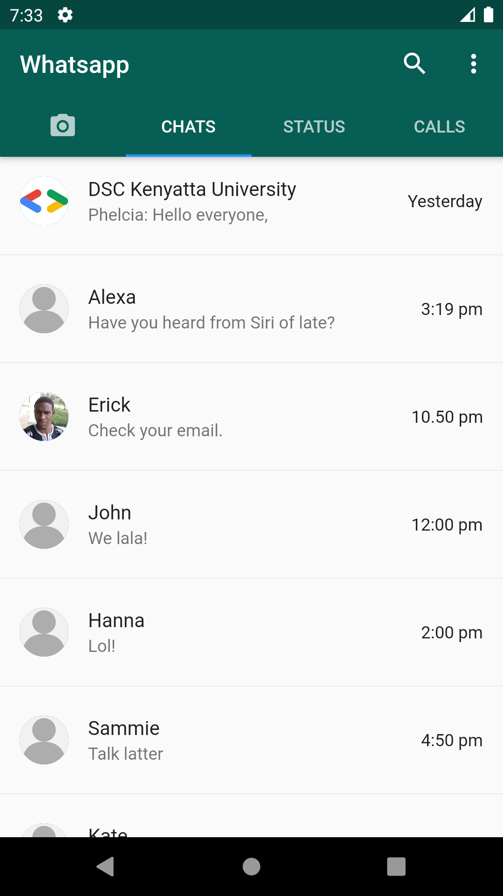

# whatsappclone

This is a sample flutter project implementing the Whatsapp Messaging App UI. It is intended to demonstrate the use of [Flutter](https://flutter.dev) - Google's UI Toolkit - in building beutiful User Interfaces.

## Prerequisites
---
Please follow the [online documentation](https://flutter.dev/docs) for guides on setting up your development environment for writing flutter applications.


## To Build The Project
---
1. First clone the project

   ```$ git clone https://github.com/DSCKenyattaUniversity/flutter-whatsapp-clone```

2. Change to the cloned directory

   ```$ cd flutter-whatsapp-clone```

3. Install the dependencies

   ```$ flutter pub get```

4. Run the app on your Android device or Android Emulator

   ```$ flutter run```

5. You would be prompted to select the device you want to run the app in and should see the screen below.

<center>
  
</center>
